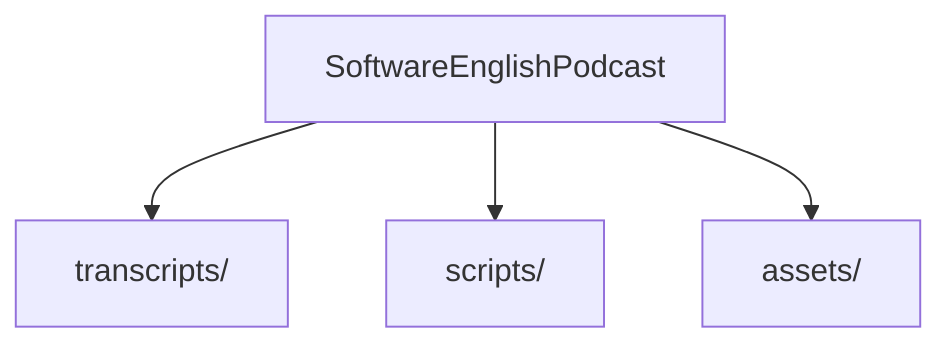

# Software English Podcast

[](LICENSE.md)

這是一個為了滿足我個人學習需求而製作的 Side Project。

因為買了單字書卻沒時間看，查發音又很麻煩，所以決定用工程師的方式解決這個問題 —— 自己寫腳本、串 API，生出一個可以陪我通勤的 Podcast。

目標很簡單：**聽懂關鍵字、矯正台式發音、學會怎麼在工作中使用這些詞。**

## 🎧 想要解決的問題

1. **沒時間看書**：把學習變成「被動輸入」，洗澡、通勤、運動都能聽。
2. **發音不標準**：工程師常把 `Azure` 念成 `Agile`，或是 `Nginx` 亂念。不如讓 Azure 的 Neural TTS (Phoebe) 來示範標準唸法。
3. **單字背了不會用**：單純背 `Dependency Injection` 沒意義，重點是在 Code Review 時要怎麼說 "We should use DI here to reduce coupling."

## 🛠️ 怎麼做的？

不想手動剪輯，所以全自動化處理：

1. **劇本 (Transcripts)**：使用 **SSML** (Speech Synthesis Markup Language) 撰寫，精細控制發音、語氣 (`express-as`) 與節奏 (`prosody`)。包含中英對照、例句與模擬對話。
2. **角色 (Voices)**：
   * **曉臻**：中文主持人。由 `zh-TW-HsiaoChenNeural` 飾演。負責引導話題、提供背景脈絡，並替聽眾提出疑問。
   * **Phoebe**：英文技術專家。由 `en-US-PhoebeMultilingualNeural` 飾演。負責發音示範、技術解說，以及職場溝通的情境演練。
   * **特別調整**：加上了 `Cheerful` 風格，讓她們聽起來像在聊天，而不是機器人唸經。
3. **自動化 (Scripts)**：寫了 PowerShell 腳本，一鍵把 30 集 SSML 全部轉成 MP3。

## 📂 專案結構



* **transcripts/**: 每一集的內容 (XML)。
* **scripts/**: 轉換用的工具程式。
* **assets/**: 產出的 MP3 檔案。

## 📖 內容規劃

目前整理了 30 集，涵蓋我平常工作或未來可能會碰到的領域：

* **基礎**：CS Basics (OS, Network, Algo)。
* **開發**：Git, Database, Backend (.NET), Frontend。
* **進階**：Cloud (AWS/Azure), Architecture, DevOps。
* **軟實力**：溝通、開會、職涯發展。

## 🚀 How to Run

如果你也有 Azure 帳號，想自己生一份來聽：

```powershell
# 設定 Azure Speech Key
$env:TTS_KEY = "your_key"
$env:TTS_REGION = "eastasia" 

# 執行轉換
./scripts/Batch-Convert.ps1
```

## 🔗 Reference

* [Speech Synthesis Markup Language (SSML) overview](https://learn.microsoft.com/zh-tw/azure/ai-services/speech-service/speech-synthesis-markup-voice)

## ⚠️ Disclaimer

本專案語音由 Azure AI 生成。內容是我自己整理加上 AI 輔助的，主要自用，僅供參考。

## 📄 License

CC BY-SA 4.0
