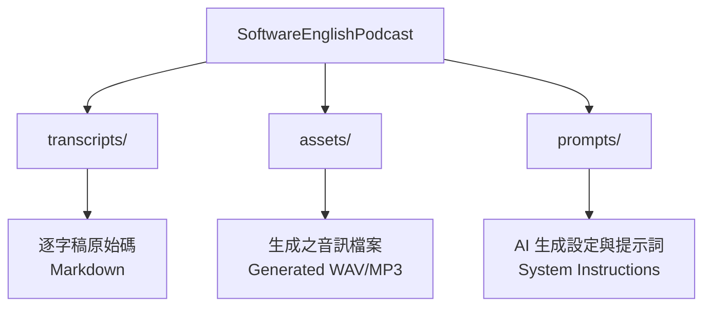

# SoftwareEnglishPodcast

這只是我為了練習軟體工程常用單字發音而製作的個人 Podcast 資源庫。

## 📂 Project Structure

本專案採用以下目錄結構進行管理：

- **`transcripts/`**
  - 存放所有的 Episode 腳本文字檔。
  - 格式：Markdown
  - 內容包含：中英對照術語、IPA/KK 音標（視需求）、情境例句。

- **`assets/`**
  - 存放對應的語音輸出檔案。
  - 此目錄內容為生成產物，隨腳本迭代更新。

- **`prompts/`**
  - 存放用於驅動 AI 生成語音腳本的 System Instructions。
  - 包含角色設定、語氣指導原則與格式規範。

## ⚠️ Disclaimer

本專案語音資源由 AI 模型生成。

- **口音**：美式英語這主。
- **用語差異**：部分中文解說可能因模型訓練資料特性，偶有出現中國大陸慣用語（如：項目、數據）之情況，以文字腳本之台灣正體中文為準。

## 📚 Reference

- [使用 Google AI Studio 生成語音檔](https://github.com/CloudyWing/HackMD-Notes/blob/main/%E4%BD%BF%E7%94%A8%20Google%20AI%20Studio%20%E7%94%9F%E6%88%90%E8%AA%9E%E9%9F%B3%E6%AA%94.md)

## 📄 License

This project is licensed under the CC BY-SA 4.0 License - see the [LICENSE.md](LICENSE.md) file for details.
